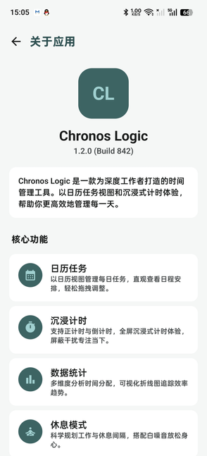
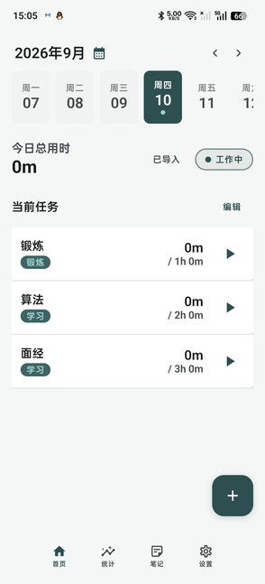
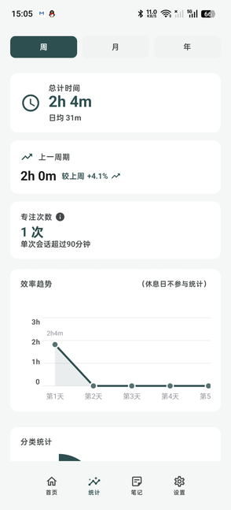

# Chronos Logic

> 一个帮助用户规划日程、沉浸专注，并回顾时间投入的 Android 时间管理应用。源码工程名为 `ChronoTask`，应用内名称为 **Chronos Logic**。

AI信息时代，各种网络信息横行，我们的精力被各种纷杂的信息所吸引，个体的专注力被切成一个个碎片，因此在这个时代，最为宝贵的是锻炼个人的专注力提升精力，以及保持个体的创造主导性，此app围绕精力，专注力为核心主题，建立了一个个人的计时系统，用户可以自己自由的制定一些任务的计划 然后参与计时，基于App的设计理念，希望用户在回消息，查看短视频等等不属于此次任务的事件，暂停计时，从而去记录用户一天真正的纯作用时间，同时我们建立日历和笔记系统和周月年的图形显示系统，直观的记录用户的净学习时间，帮助用户直观的观察自己的精力集中和时间调配情况

Chronos Logic 不把“完成更多任务”作为唯一目标。它将任务安排、专注计时、统计回顾和休息规划放在同一条时间线上，帮助用户看清今天要做什么、正在投入什么，以及时间最终流向了哪里。

## 设计原则

- **日程先于待办堆积**：任务归属于明确日期，首页以日历和当天任务为中心，而不是无限增长的清单。
- **专注时不打扰**：计时支持开始、暂停、恢复与前后台持续运行；用户不必为记录时间频繁切换页面。
- **统计必须可信**：统计按用户定义的“每日起始时间”归属记录，处理跨日与暂停，避免把时间简单地按自然零点切断。
- **数据可解释、可恢复**：任务、历史记录、笔记和设置分别持久化；进行中的计时会话可保存并恢复。
- **少输入也能开始**：支持快速导入常用任务模板，同时保留手动创建、标签与目标时长等细粒度管理能力。

## 功能一览

| 功能 | 用户可以做什么 |
| --- | --- |
| 日历任务 | 按日期查看、创建、编辑和完成任务；为任务设置标签与目标时长。 |
| 快速导入 | 将常用任务模板一键导入当天计划，减少重复录入。 |
| 沉浸计时 | 对单个任务开始、暂停、恢复和停止计时；支持前后台持续与会话恢复。 |
| 时间统计 | 查看周、月、年维度的总时长、趋势、分类占比和专注次数。 |
| 任务笔记 | 在任务详情中记录过程笔记，保留历史内容。 |
| 工作与休息 | 设置工作日、休息日和每日起始时间，让计划与统计符合个人作息。 |
| 个性化 | 支持主题、语言和头像等基础个性化配置。 |

## 页面展示

<p align="center">
  
  
  
</p>

<p align="center">
  <sub>左：产品与核心能力 ｜ 中：首页日历与任务 ｜ 右：周月年统计</sub>
</p>

## 快速开始

### 环境要求

- JDK 17
- Android Studio（建议使用稳定版）
- Android SDK：`compileSdk 36`，`minSdk 24`，`targetSdk 36`

### 构建与运行

```bash
# Windows
.\gradlew.bat :chronotask-applications:mobile:assembleDebug

# macOS / Linux
./gradlew :chronotask-applications:mobile:assembleDebug
```

生成的 Debug APK 位于：

```text
chronotask-applications/mobile/build/outputs/apk/debug/
```

### 运行核心测试

```bash
# JVM 单元测试：日期边界、计时状态机、统计周期与请求门控
.\gradlew.bat :chronotask-components:common:testDebugUnitTest :chronotask-pages:stats:testDebugUnitTest

# 需要已连接模拟器或设备：Room 迁移与数据完整性测试
.\gradlew.bat :chronotask-components:database:connectedDebugAndroidTest
```

## 技术栈

| 领域 | 方案 |
| --- | --- |
| 语言与 UI | Kotlin、Jetpack Compose、Material 3 |
| 架构 | 多模块、MVVM、Repository、StateFlow / Coroutines |
| 本地数据 | Room、KSP、Room Migration、Schema Export |
| 用户设置 | DataStore Preferences |
| 导航 | Navigation 3 + KSP 生成目的地注册 |
| 图像 | Coil Compose、系统 Photo Picker |
| 构建 | Gradle Kotlin DSL、Version Catalog、Convention Plugins |
| 质量保障 | JUnit、Room MigrationTestHelper、GitHub Actions |

## 架构与实现结构

```text
chronotask
├── chronotask-applications/
│   └── mobile/                    # Application、MainActivity、应用组合根、前台服务入口
├── chronotask-components/
│   ├── common/                    # 日期、计时会话、偏好与通用能力
│   ├── database/                  # Room Entity、DAO、Repository、Migration 与数据库测试
│   ├── navigation/                # Navigation 3 基础设施与 KSP 处理器
│   └── ui/                        # 主题、组件、通用选择器与资源
├── chronotask-pages/
│   ├── home/                      # 日历任务与快速导入
│   ├── create/                    # 创建与编辑任务
│   ├── taskdetail/                # 任务详情、计时、笔记
│   ├── stats/                     # 周/月/年统计与图表
│   ├── notes/                     # 笔记浏览
│   └── settings/                  # 工作日、日界、主题、语言与快速导入设置
└── .github/workflows/             # 构建、单测与数据库迁移验证
```

### 模块职责展开

| 层级 / 模块 | 主要内容 | 在运行时承担的职责 |
| --- | --- | --- |
| `chronotask-applications/mobile` | `ChronoTaskApplication`、`MainActivity`、`TabsDestination` | 应用的组合根：初始化计时依赖和通知/前台服务协作；挂载 Compose 与 Navigation 3；集中装配首页、统计、笔记、设置四个一级页面。它只负责组装，不承载页面业务规则。 |
| `chronotask-components/common` | `TimerSessionStateMachine`、`TimerManager`、`TimerClock`、`TimerSessionStore`、`DateUtils`、偏好能力 | 放置跨功能的业务基础设施。计时状态机是可脱离 Android 运行的纯 Kotlin 逻辑；管理器负责协程 tick、状态流、恢复快照和持久化协调；日期工具负责业务日与自然周期计算。 |
| `chronotask-components/database` | Room `Entity`、`Dao`、`Repository`、Migration、AndroidTest | 本地数据边界。DAO 用 SQL 完成筛选、关联和聚合；Repository 给页面和计时流程提供面向业务的读写接口；迁移与 schema 文件保证版本演进可验证。 |
| `chronotask-components/navigation` | Navigation 3 基础能力、目的地注册处理器 | 定义页面跳转的基础设施和目的地注册，减少各页面手写、分散的导航装配代码。 |
| `chronotask-components/ui` | 主题、颜色/字体、通用组件、选择器与资源 | 提供可复用的视觉和交互基础，不拥有任务、计时或统计业务状态。 |
| `chronotask-pages/*` | Feature API 合约与对应实现 | 以功能切分页面：`home` 管理日期任务和快速导入，`create` 管理任务编辑，`taskdetail` 承载计时与笔记入口，`stats` 负责周期统计，`notes` 浏览笔记，`settings` 配置业务日、工作/休息与个性化。每个功能由 Screen + ViewModel + Destination 组成。 |

Feature 目录同时保留 API/实现的边界：API 表达页面参数和跳转契约，具体的 Compose Screen 与 ViewModel 留在实现模块。`mobile` 是组合具体页面的入口；Feature 之间经契约和基础组件协作，而不是直接引用对方的 UI 实现。这样在增加独立页面、替换页面实现或执行模块级测试时，影响范围更可控。

### 页面内部的实现方式

每个功能页面沿用相同的职责切分：

```text
Destination（声明路由与入参）
        ↓
Screen（Compose：渲染 UiState、转发用户事件）
        ↓
ViewModel（StateFlow：组织页面状态、处理协程与事件）
        ↓
Repository / TimerManager（业务读写与会话协调）
        ↓
Room DAO / DataStore / Android 前台服务
```

- **Screen 不直接访问数据库**：它订阅 ViewModel 暴露的 `StateFlow`，将点击、输入和切换周期等事件交回 ViewModel。
- **ViewModel 负责页面生命周期内的异步工作**：例如首页按日期加载任务，统计页生成周期范围并发起聚合查询；请求门控确保只有最新一次统计请求能回写 UI。
- **Repository 是数据访问边界**：任务、记录、标签、笔记、休息日和专注会话各自封装 DAO 调用，避免 SQL 与事务逻辑散落到 UI 层。
- **计时是一条独立业务链路**：任务详情或首页发出开始/暂停/停止事件后，由 `TimerManager` 调用状态机、时钟与会话存储，并在停止或跨业务日时通过 Repository 写入任务记录。

### 数据归属与数据流

| 数据类型 | 保存位置 | 关键用途 |
| --- | --- | --- |
| 任务、标签、任务记录、笔记、专注会话、休息日 | Room | 支撑日历展示、计时落库、统计聚合和历史追溯；任务关联删除由事务与外键规则保护。 |
| 主题、语言、每日起始时间、快速导入配置等偏好 | DataStore Preferences | 保存跨启动的个人设置；每日起始时间同时参与计时分段和统计归属。 |
| 正在运行的计时会话快照 | 会话存储 + 运行时 `StateFlow` | 记录开始时间、暂停状态和累计时长，使前后台切换或进程重建后可以恢复。 |
| 瞬时页面状态 | ViewModel `StateFlow` | 例如加载状态、当前所选日期/周期、任务列表和图表模型；不把短暂 UI 状态误写入数据库。 |

整体读写链路如下：

```text
用户操作 → Compose Screen → ViewModel
                         ├→ Repository → Room DAO → SQLite
                         ├→ Preferences → DataStore
                         └→ TimerManager → 状态机 / 时钟 / 会话快照

Room 或 DataStore 的数据变化 → Flow / StateFlow → ViewModel UiState → Compose 重组
```

这套分层并不追求形式上的“层数越多越好”：纯状态转换、数据库事务、SQL 聚合和 Android 生命周期协作分别留在最适合测试和维护的位置，页面模块则聚焦于用户可见的业务流程。

## 关键实现

### 1. 可恢复的计时会话与双时钟语义

计时器不是简单地每秒累加。项目将开始、暂停、恢复、停止和恢复快照等状态转换收敛在 `TimerSessionStateMachine` 中；`TimerManager` 负责运行时协调、`StateFlow`、持久化和前台服务联动。

- **单调时钟**用于计算已流逝时长，降低手动修改系统时间、网络校时对计时显示的影响。
- **墙上时间**用于拆分记录和业务日归属，保证统计结果能映射到真实日历。
- 会话开始时冻结用户设置的每日起始偏移；跨越业务日边界时，将活动时间片段拆分并分别落库。

这使“暂停不计时、跨日统计、进程恢复”拥有同一套可测试的业务语义。

### 2. 在 SQL 层消除统计 N+1 查询

统计页原本会先读取记录，再按任务或标签逐项读取关联信息，数据量增长时会形成 N+1 数据库访问。现在将关联、过滤与聚合下推到 Room DAO：

```sql
task_records
  INNER JOIN tasks
  LEFT JOIN tags
  WHERE date BETWEEN periodStart AND periodEnd
  GROUP BY tag / date
  SUM(durationSeconds)
```

UI 仅消费少量的周期摘要、每日趋势和标签汇总结果，减少数据库往返、中间对象和应用层聚合开销。统计请求同时有请求门控，慢的旧请求不能覆盖用户刚切换的周期。

### 3. 数据一致性：删除、导入与迁移

- **运行中任务不可删除**：UI 与 ViewModel 双层拦截，避免计时停止时向已删除任务写入记录。
- **删除在事务中完成**：先清理没有外键约束的 `focus_sessions`，再删除任务；`task_records` 通过外键级联清理。
- **快速导入保持幂等**：`tasks(scheduledDate, quickImportKey)` 唯一索引配合 `IGNORE` 写入，避免双击或并发协程插入重复任务。
- **Room 版本演进**：导出 schema，维护 v6→v10 迁移，并覆盖索引、业务日期键和快速导入唯一键的升级场景。

### 4. 异步状态与自然周期

周、月、年切换不再以固定毫秒长度倒推上一周期，而是基于日历的 `Calendar.add(MONTH/YEAR, -1)` 推导自然周期，避免大小月和年度边界偏差。统计读取限制为最新请求可更新 UI，避免异步结果乱序导致的状态倒灌。

## 测试与持续集成

项目覆盖以下关键风险：

- `TimerSessionStateMachine`：暂停、恢复、停止、会话恢复。
- `DateUtils`：业务日边界与日期计算。
- `StatsPeriodRangeCalculator`、`StatsRequestGate`：自然周期与旧请求保护。
- Room：v6→v10 迁移、统计聚合、删除关联清理、快速导入并发。

GitHub Actions 会在 Pull Request 与 `main` 分支推送时执行 Debug 构建与 JVM 测试，并通过 Android Emulator 执行数据库迁移 AndroidTest。

> 本地执行 AndroidTest 需要连接模拟器或真机；JVM 测试不需要设备。

## 当前边界与后续方向

- 早期 v1→v5 的 Room schema 未保留，因此无法补做真实的历史迁移回归；从 v6 开始已导出 schema 并纳入测试。
- `TimerManager` 仍是进程级协调器，但核心状态转换、时钟和会话存储已经解耦，后续可按复杂度需要接入依赖注入容器。
- 后续会继续补充真机/模拟器 UI 验证，并完善统计性能基准。

## 许可证

当前仓库尚未指定开源许可证。如计划公开复用，请在发布前补充 `LICENSE`。
